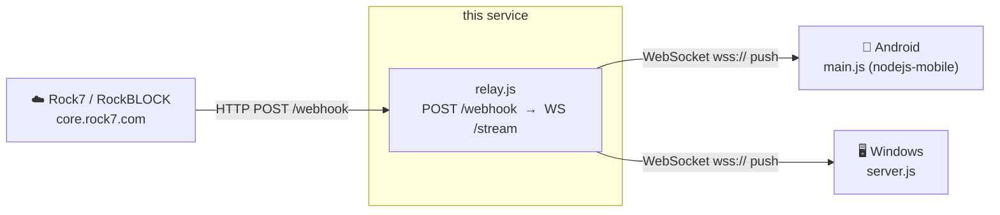

# ASV Relay

Lightweight Node.js/Express server that bridges Rock7's RockBLOCK HTTP webhook to persistent WebSocket clients. Used by the [ctrl](https://github.com/mvaughn51/ctrl) ASV control app on both Android and Windows.

Deployed to Render — auto-deploys on push to `master`.

---

## Role in the pipeline



Rock7 delivers each Iridium MO message to `/webhook` via HTTP POST. The relay immediately fans it out to all connected WebSocket clients on `/stream`. Clients initiate outbound connections — no client needs a public-facing URL.

---

## Endpoints

| Method | Path | Description |
|--------|------|-------------|
| `GET` | `/` | HTML status dashboard — uptime, client count, last message |
| `GET` | `/status` | JSON health snapshot |
| `GET` | `/ping` | Keepalive probe — returns `200 OK` |
| `POST` | `/webhook` | Receives RockBLOCK MO messages from Rock7 |
| `WS` | `/stream` | Persistent WebSocket — clients connect here |

### Webhook payload (Rock7 → relay)

Rock7 sends `application/x-www-form-urlencoded` POST:

| Field | Description |
|---|---|
| `imei` | RockBLOCK device IMEI |
| `momsn` | MO message sequence number |
| `transmit_time` | UTC timestamp |
| `iridium_latitude` | Fix latitude (degrees) |
| `iridium_longitude` | Fix longitude (degrees) |
| `iridium_cep` | Circular error probable (km) |
| `data` | Hex-encoded message payload |

### WebSocket broadcast (relay → clients)

Each connected client receives the Rock7 fields re-broadcast as JSON:

```json
{
  "imei": "300434067867130",
  "momsn": 42,
  "transmit_time": "2026-06-04 14:10:00",
  "iridium_latitude": 34.5,
  "iridium_longitude": -119.5,
  "iridium_cep": 3,
  "data": "23453941..."
}
```

`data` is the hex-encoded raw payload from the ASV's Iridium modem.

---

## Deployment (Render)

### Service settings

| Setting | Value |
|---|---|
| **Repository** | `github.com/mvaughn51/relay` |
| **Branch** | `master` |
| **Build command** | `npm install` |
| **Start command** | `node relay.js` |
| **Instance type** | Free (0.1 CPU, 512 MB) |

### Environment variables

| Variable | Description |
|---|---|
| `PORT` | Set automatically by Render |
| `RENDER_EXTERNAL_URL` | Set to `https://<relay-host>` to enable the keepalive ping |

### Keepalive

Render free-tier instances sleep after 15 minutes of inactivity. With `RENDER_EXTERNAL_URL` set, the relay pings its own `/ping` endpoint every 14 minutes to stay warm. Without it, the first satellite message after a period of inactivity will be lost (Rock7 retries, but the cold-start delay can exceed the retry window).

---

## RockBLOCK configuration

In the RockBLOCK portal under **My Devices → Delivery Groups**:

- **Delivery type:** HTTP POST
- **URL:** `https://<relay-host>/webhook`

> The URL must end with `/webhook`. The root path `/` returns the HTML dashboard — Rock7 will see `200 OK` and stop retrying, but the message is never forwarded to clients.

---

## Running locally

```bash
npm install
node relay.js
```

Listens on port `3001` by default. Set `PORT` to override.

---

## Testing

**Send a fake webhook:**

```bash
curl -X POST https://<relay-host>/webhook \
  -H "Content-Type: application/x-www-form-urlencoded" \
  -d "imei=300434067867130&momsn=1&transmit_time=2026-06-04+12:00:00&iridium_latitude=34.5&iridium_longitude=-119.5&iridium_cep=5&data=23453941" \
  -w "\nHTTP %{http_code} in %{time_total}s\n"
```

Expected: `HTTP 200` in under 1 s. A slow response (~30 s) indicates a cold start.

**Verify WebSocket broadcast:**

```bash
npm install -g wscat
wscat -c wss://<relay-host>/stream
# fire the curl above — the JSON payload should appear in wscat
```

**Check the status dashboard:**

Open `https://<relay-host>/` in a browser. The dashboard polls `/status` every 3 s and shows uptime, connected client count (green when > 0), total messages relayed, and the timestamp/IMEI/MOMSN of the last delivery.
